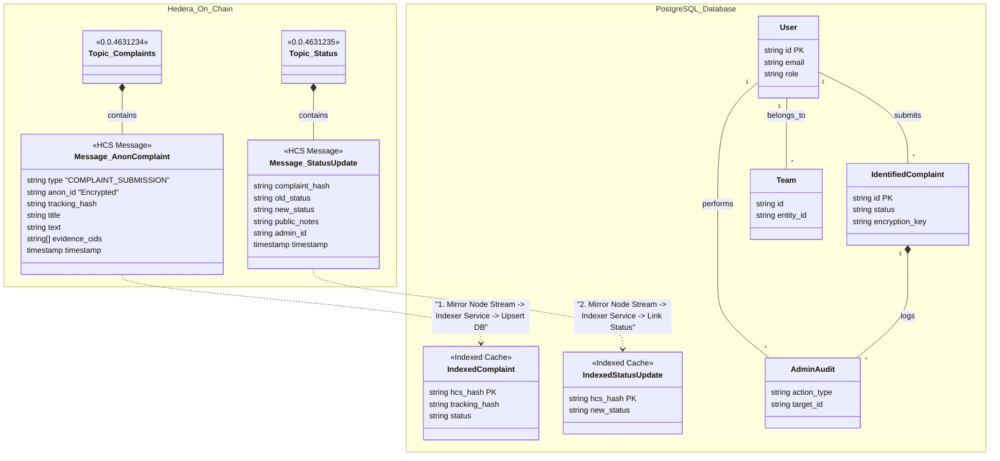
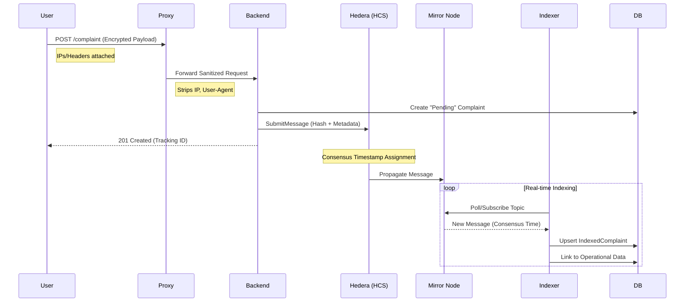

# Sawtak - Anonymous Whistleblowing Platform

## 1. Problem Statement
In many organizations and government bodies, misconduct, corruption, and safety hazards go unreported due to a **fear of retaliation**. Existing systems often require personal identification (National ID, Phone Number), which discourages whistleblowers from coming forward.

**The Privacy Gap:**
*   Users fear their identity will be leaked to the accused.
*   "Anonymous" checkboxes in traditional forms are often trust-based, not technically guaranteed.
*   Lack of transparency in how complaints are handled/resolved.

---

## 2. Competitors & Differentiation

### Primary Competitor: Unified Government Complaints System (Shakwa.eg)
*   **Current State**: Centralized system for Egyptian government complaints.
*   **Limitation**: Requires National ID for registration. Anonymity is policy-based, not enforced by technology. Audit trails are centralized and mutable by admins.

### Sawtak's Competitive Edge
1.  **Guaranteed Anonymity**:
    *   **Privacy Proxy**: Separates user identity from complaint data before it even hits the database.
    *   **Encryption**: Complaints are encrypted; keys are managed strictly.
2.  **Immutable Audit Trails (Blockchain)**:
    *   Every status change, access log, and note is recorded on **Hedera Consensus Service (HCS)**.
    *   Logs cannot be deleted or altered by database administrators, preventing cover-ups.
3.  **Audit-Proof Integrity**: Even Sawtak developers cannot alter the history of a complaint without detection.

---

## 3. Key Features
*   **Anonymous Complaint Submission**: Text + Evidence (Images/Docs) uploaded securely via IPFS.
*   **Flexible Visibility Control**:
    *   **Public Complaints**: Visible on the community feed; citizens can upvote to increase priority.
    *   **Private Complaints**: Strictly confidential between the whistleblower and the assigned authority.
*   **Role-Based Dashboard**:
    *   **Reviewers**: Triage and validate complaints.
    *   **Managers**: Investigate and resolve issues.
    *   **Team Admins**: Handle legal escalations and monitor team performance.
    *   **Platform Admins**: Oversee system health and handle Identity Reveal requests.
*   **Identity Reveal Workflow**: A rigorous, dual-approval process to reveal a whistleblower's identity *only* in cases of severe legal necessity (e.g., threat to life).
*   **Real-time Collaboration**: WebSocket-based updates using Redis Pub/Sub.
*   **Multi-Language Support**: Full Arabic/English localization (RTL support).

---

## 4. Privacy Workflows

### The "Privacy Proxy" Architecture
To ensure true anonymity, Sawtak employs a dedicated proxy layer:

1.  **Submission**: User submits data to `https://sawtak.org/submit`.
2.  **Proxy Interception**: The Proxy Server receives the request. It strips ALL metadata (IPs, User Agent, Session Tokens).
3.  **Scrubbing**: It replaces the user's ID with a simplified `anonymous_identifier` derived from a hashing algorithm that prevents reverse-lookup.
4.  **Forwarding**: The clean data is forwarded to the Core Backend.
5.  **Storage**: The Backend stores the data. It *cannot* trace the request back to the original socket.

### Identity Reveal Protocol (The "Break-Glass" Mechanism)
Anonymity is default, but accountability is necessary for false reporting or threats.
1.  **Request**: A **Team Admin** requests an identity reveal, providing a legal justification.
2.  **Review**: The **Platform Admin** receives the request.
3.  **Approval**: The Platform Admin reviews the justification. If valid, they effectively "approve" it.
4.  **Decryption**: A strictly offline decryption key (held only by the Platform Admin) is used to decrypt the link between the `anonymous_identifier` and the `User ID`.
5.  **Audit**: This generated "Reveal Event" is permanently logged to the Blockchain (HCS) so the action is visible to auditors forever.

---

## 5. Technology Stack

### Frontend
*   **Framework**: Next.js 15 (React 19 RC)
*   **Runtime**: Bun
*   **Styling**: TailwindCSS + Shadcn/UI (Dark Mode Logic)
*   **State Management**: TanStack Query (React Query)
*   **Internationalization**: `next-intl` (English & Arabic)

### Backend
*   **Runtime**: Bun (High-performance JS runtime)
*   **Framework**: ElysiaJS (Fastest Node-compatible framework)
*   **ORM**: Prisma
*   **Authentication**: Google OAuth + Custom JWT

### Infrastructure & Data
*   **Database**: PostgreSQL 16
*   **Caching & Pub/Sub**: Redis (BullMQ for background jobs)
*   **Blockchain**: Hedera Hashgraph (Consensus Service for Audit Logs)
*   **Storage**: IPFS (Web3.Storage for immutable evidence preservation)

---

## 6. Hybrid Data Model & Workflow
*Unified view showing the "Off-Chain" Operational Database and the "On-Chain" Anonymous Ledger.*



## 7. System Architecture
*Comprehensive component diagram highlighting the Privacy Proxy, HCS Indexing, and Storage Layer.*

```mermaid
graph TD
    subgraph Client_Side [Client Layer]
        Web[Web Dashboard]
    end

    subgraph Security_DMZ [Security Layer]
        Proxy[Privacy Proxy (Nginx)]
        Haweya[Haweya Identity Provider]
    end

    subgraph Core_Cluster [Sawtak Core Services]
        API[Backend API (ElysiaJS)]
        Indexer[HCS Indexer Service]
    end

    subgraph Data_Persistence [Storage Layer]
        DB[(PostgreSQL)]
        R2[Cloudflare R2 (Hot Storage)]
    end

    subgraph Decentralized_Ledger [Immutable Layer]
        HCS[Hedera Consensus Service]
        IPFS[IPFS (Cold Evidence)]
    end

    %% Flow
    Web -->|Auth (National ID)| Haweya
    Haweya -->|OAuth Token| Web
    
    Web -->|Submit Complaint| Proxy
    Proxy -->|Sanitized| API
    
    API -->|Metadata| DB
    API -->|Audit Logs| HCS
    
    API -->|Upload Evidence| R2
    R2 -.->|Backup| IPFS
    
    HCS -->|Consensus| Indexer
    Indexer -->|Verify| DB
```

### Detailed Data Flow (Submission & Indexing)
*The lifecycle of a complaint from user submission to blockchain verification.*



---

## 8. Deployment & Containerization
The system is fully containerized using **Docker**.
*   `frontend`: Next.js container (Standalone build).
*   `backend`: Bun container (Distroless, minimized).
*   `proxy`: Nginx container for rate limiting and scrubbing.
*   `redis`: For job queues and caching.
*   `postgres`: Primary datastore.

**Orchestration**: Docker Compose for dev/staging; Kubernetes (K8s) ready for production (e.g., AWS EKS or DigitalOcean).

---

## 9. Future Goals
1.  **Gov/Id Integration**: Integrate with `EgyptDigital` (Misr Digital) for verified specialized accounts.
2.  **AI Analysis**: Use NLP to auto-categorize complaints and detect duplicate spam reports.
3.  **Mobile App**: React Native version for offline drafting of complaints.
4.  **Offline-First**: Allow submission via SMS for areas with poor internet connectivity.

---

## Presentation Tools Recommendations
To present this effectively within 15 minutes:
1.  **Pitch.com**: "Startup" or "Dark Mode" templates. Excellent for tech stacks and fast visuals.
2.  **Slides.com**: Good for developer-focused presentations (supports code blocks properly).
3.  **PowerPoint/Keynote Templates**: Look for "SaaS Dashboard" or "Cybersecurity" themes (Dark blues, violets, neon accents).

**Suggested Time Allocation (Excluding Demo):**
*   **Introduction (Problem & Solution)**: 3 mins
    *   *Focus*: The "Trust Gap" and fear of retaliation.
*   **Competitor Analysis (Shakwa)**: 2 mins
    *   *Focus*: "Policy-based Anonymity" vs "Mathematical Anonymity".
*   **Core Architecture & Privacy**: 6 mins
    *   *Focus*: The "Proxy" layer, HCS immutability, and Encryption. This is the "Meat" of the project.
*   **Features & Workflows**: 3 mins
    *   *Focus*: The "Identity Reveal" protocol and Role-based dashboards.
*   **Future Roadmap**: 1 min
    *   *Focus*: Moving to Gov integration.

*(Demo session assumed to be separate)*
