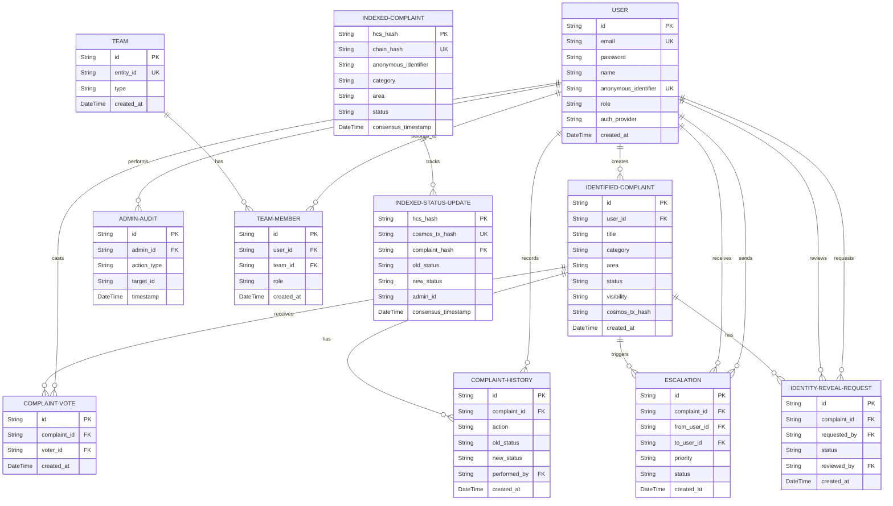

# Sawtak Prisma ERD

```mermaid
erDiagram
    USER ||--o{ IDENTIFIED-COMPLAINT : creates
    USER ||--o{ ADMIN-AUDIT : performs
    USER ||--o{ COMPLAINT-VOTE : casts
    USER ||--o{ TEAM-MEMBER : belongs_to
    USER ||--o{ COMPLAINT-HISTORY : records
    USER ||--o{ ESCALATION : sends
    USER ||--o{ ESCALATION : receives
    USER ||--o{ IDENTITY-REVEAL-REQUEST : requests
    USER ||--o{ IDENTITY-REVEAL-REQUEST : reviews

    IDENTIFIED-COMPLAINT ||--o{ COMPLAINT-VOTE : receives
    IDENTIFIED-COMPLAINT ||--o{ COMPLAINT-HISTORY : has
    IDENTIFIED-COMPLAINT ||--o{ ESCALATION : triggers
    IDENTIFIED-COMPLAINT ||--o{ IDENTITY-REVEAL-REQUEST : has

    TEAM ||--o{ TEAM-MEMBER : has

    INDEXED-COMPLAINT ||--o{ INDEXED-STATUS-UPDATE : tracks

    USER {
        String id PK
        String email UK
        String password
        String name
        String anonymous_identifier UK
        String role
        String auth_provider
        DateTime created_at
    }
    
    IDENTIFIED-COMPLAINT {
        String id PK
        String user_id FK
        String title
        String category
        String area
        String status
        String visibility
        String cosmos_tx_hash
        DateTime created_at
    }
    
    INDEXED-COMPLAINT {
        String hcs_hash PK
        String chain_hash UK
        String anonymous_identifier
        String category
        String area
        String status
        DateTime consensus_timestamp
    }
    
    INDEXED-STATUS-UPDATE {
        String hcs_hash PK
        String cosmos_tx_hash UK
        String complaint_hash FK
        String old_status
        String new_status
        String admin_id
        DateTime consensus_timestamp
    }
    
    ADMIN-AUDIT {
        String id PK
        String admin_id FK
        String action_type
        String target_id
        DateTime timestamp
    }
    
    COMPLAINT-VOTE {
        String id PK
        String complaint_id FK
        String voter_id FK
        DateTime created_at
    }
    
    TEAM {
        String id PK
        String entity_id UK
        String type
        DateTime created_at
    }
    
    TEAM-MEMBER {
        String id PK
        String user_id FK
        String team_id FK
        String role
        DateTime created_at
    }
    
    COMPLAINT-HISTORY {
        String id PK
        String complaint_id FK
        String action
        String old_status
        String new_status
        String performed_by FK
        DateTime created_at
    }
    
    ESCALATION {
        String id PK
        String complaint_id FK
        String from_user_id FK
        String to_user_id FK
        String priority
        String status
        DateTime created_at
    }
    
    IDENTITY-REVEAL-REQUEST {
        String id PK
        String complaint_id FK
        String requested_by FK
        String status
        String reviewed_by FK
        DateTime created_at
    }
```
